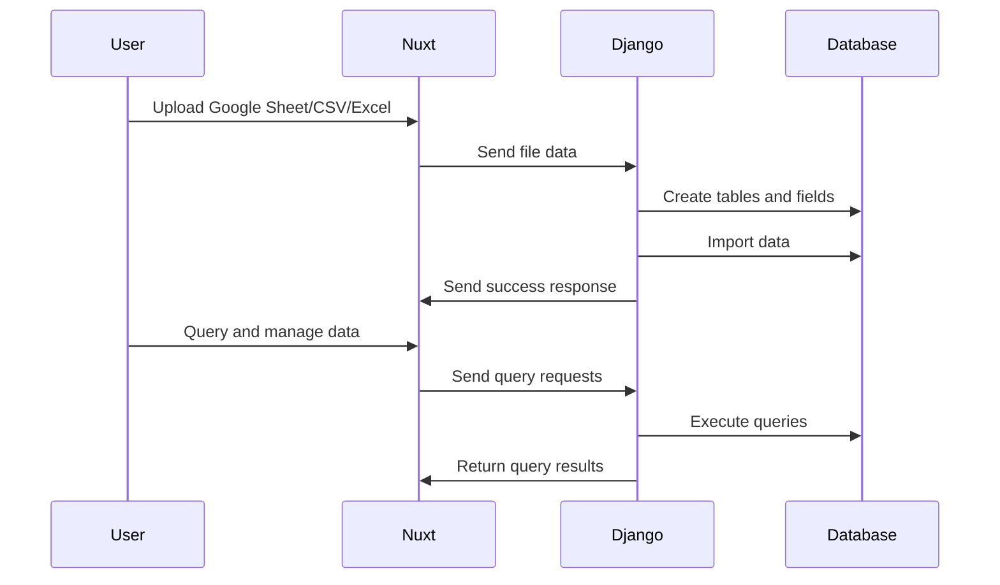

# My Database

Transform any Google Sheet, CSV file or Excel Sheet into a database just like magic! ✨

## Features 🌳

- Import data from a Google Sheets, CSV files, or Excel files and automatically create database tables and fields
- Support for multiple data types (text, number, date, etc.)
- User-friendly interface for managing your database
- Link your databases with modern applications and services like Zapier, Make, Airtable, Supabase or any MCP you like!
- Real-time updates and collaboration with websockets
- Background processing of data imports with Celery and Redis
- Built with Nuxt 4 and Django for a seamless full-stack experience

## Getting Started 🚀

1. Clone the repository
2. Install dependencies
3. Run the application
4. Connect to your Google Sheets or Excel files
5. Start transforming your data into a database!

## Technologies Used 🛠 

| Technology | version |
| --------------- | ------ |
| Nuxt 4          | ✅ 4.x |
| Python (Django) | ✅ 6.x |
| Celery + Redis  | ✅ 5.x |
| Tailwindcss     | ✅ 3.x |

### How it is built? 🛖

The application uses websocket to communicate and exchange data between the frontend and backend in real-time for building the databases. This allows for quick data manipulation during construction.

## How it works? 🔍

1. User uploads a Google Sheets, CSV file, or Excel file.
2. The application reads the file and extracts the data.
3. The user maps the spreadsheet columns to database fields.
4. The application creates the database schema and imports the data.
5. The user can then query and manage the data through the application interface.

## License 📄

This project is licensed under the MIT License - see the [LICENSE](LICENSE) file for details.
