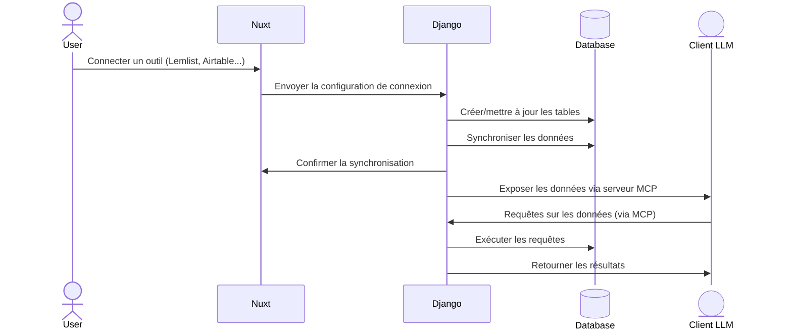

# Lorélie

Connectez tous vos outils, unifiez vos données, et donnez à votre LLM un accès direct — sans écrire une ligne de code. ✨

## Le problème

Vos données sont éparpillées entre Lemlist, Airtable, votre CRM, vos feuilles de calcul... Pour qu'un assistant IA puisse réellement les exploiter, il faudrait construire un serveur MCP par outil. C'est long, technique, et hors de portée pour la plupart des équipes sans développeur dédié.

## Ce que fait Lorélie

Lorélie est un **serveur MCP visuel** : une interface no-code qui vous permet de connecter vos outils (Lemlist, Airtable, CRM, fichiers Excel/CSV/Google Sheets, et bien d'autres), de les fusionner dans une base de données unifiée, puis d'exposer cette base à n'importe quel client LLM via un simple lien MCP.

Résultat : votre assistant IA peut interroger et manipuler l'ensemble de vos données métier, sans que vous ayez à coder le moindre connecteur.

## Fonctionnalités 🌳

- Connectez vos outils (Lemlist, Airtable, CRM, Google Sheets, CSV, Excel, et plus à venir) en quelques clics
- Fusionnez et structurez automatiquement vos données en une base unifiée
- Exposez cette base via un serveur MCP prêt à l'emploi — aucun code requis
- Interagissez avec vos données directement depuis votre client LLM préféré (Claude, ChatGPT, etc.)
- Mises à jour en temps réel et collaboration via websockets
- Traitement en arrière-plan des synchronisations avec Celery et Redis
- Construit avec Nuxt 4 et Django pour une expérience full-stack fluide

## Comment ça marche ? 🔍

1. L'utilisateur connecte un ou plusieurs outils (Lemlist, Airtable, CSV, etc.) via l'interface Lorélie.
2. Lorélie importe et structure les données dans une base unifiée.
3. L'utilisateur mappe et organise les champs si besoin.
4. Lorélie génère automatiquement un serveur MCP exposant cette base.
5. L'utilisateur connecte ce serveur MCP à son client LLM et interagit directement avec ses données.

```mermaid
sequenceDiagram
    actor User
    participant Nuxt
    participant Django
    participant Database@{type: "database"}
    participant LLM@{type: "entity"} as Client LLM

    User->>Nuxt: Connecter un outil (Lemlist, Airtable...)
    Nuxt->>Django: Envoyer la configuration de connexion
    Django->>Database: Créer/mettre à jour les tables
    Django->>Database: Synchroniser les données
    Django->>Nuxt: Confirmer la synchronisation
    Django->>LLM: Exposer les données via serveur MCP
    LLM->>Django: Requêtes sur les données (via MCP)
    Django->>Database: Exécuter les requêtes
    Django->>LLM: Retourner les résultats
```

## Getting Started 🚀

1. Clonez le repository
2. Installez les dépendances
3. Lancez l'application
4. Connectez vos premiers outils (Lemlist, Airtable, etc.)
5. Générez votre serveur MCP et connectez-le à votre client LLM

## Technologies utilisées 🛠

| Technology      | Version |
| --------------- | ------- |
| Nuxt 4          | ✅ 4.x  |
| Python (Django) | ✅ 6.x  |
| Celery + Redis  | ✅ 5.x  |
| Tailwindcss     | ✅ 3.x  |

## License 📄

This project is licensed under the MIT License - see the [LICENSE](LICENSE) file for details.
