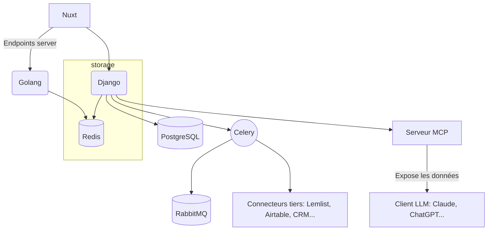
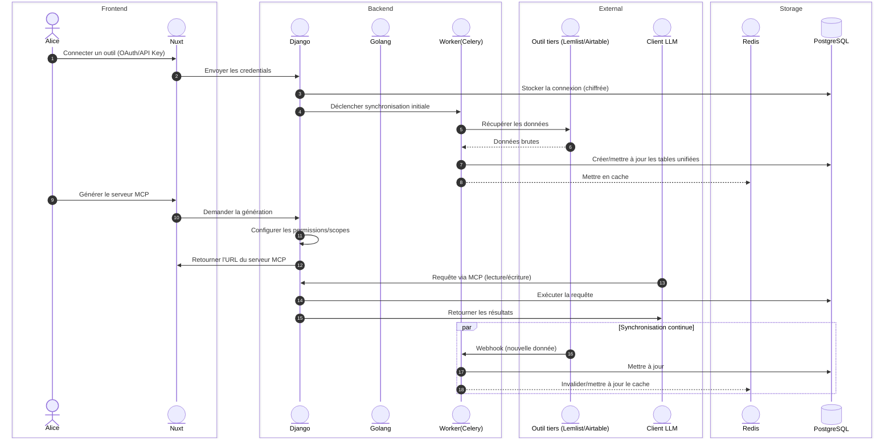
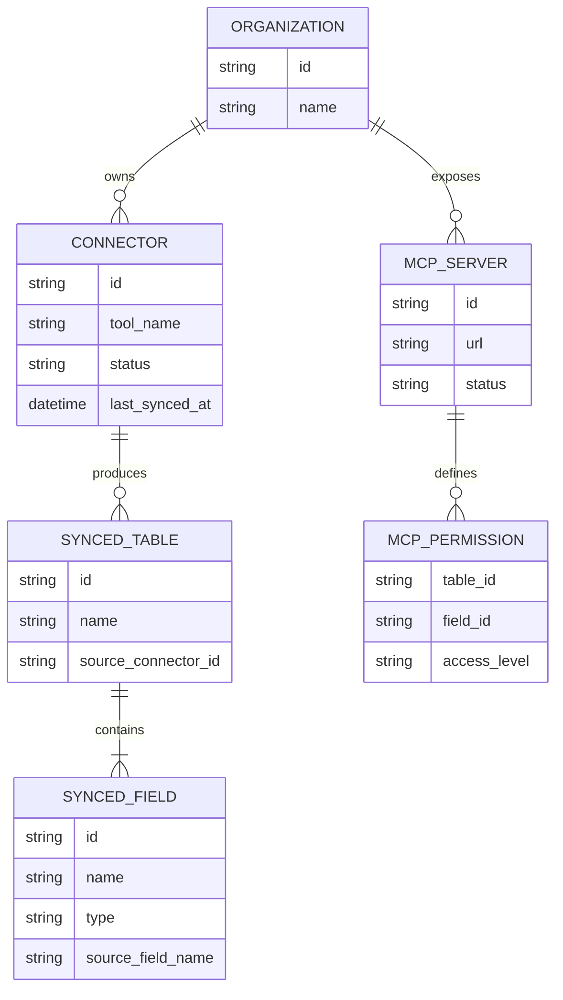

# Lorélie — Architecture

## Requirements & Assumptions 🟠

### Clarifying Questions

*Questions à trancher pour mieux cadrer les besoins et contraintes du système*

- **Connecteurs** Quels outils prioriser en premier (Lemlist, Airtable, HubSpot, Google Sheets, CSV/Excel) ? Faut-il un SDK de connecteurs génériques pour en ajouter facilement ?
- **Authentification aux outils tiers** OAuth par outil ? Clés API ? Comment sont stockées et chiffrées les credentials des utilisateurs ?
- **Synchronisation** Temps réel (webhooks) ou batch (polling périodique) ? Cela dépend-il de l'outil connecté ?
- **Serveur MCP** Un serveur MCP par utilisateur/organisation, ou un serveur mutualisé avec isolation des données par tenant ?
- **Permissions** Comment l'utilisateur contrôle-t-il quelles données sont exposées au LLM via MCP (tout / certaines tables / certains champs) ?
- **Client LLM** Doit-on supporter un protocole MCP standard générique, ou prévoir des intégrations spécifiques (Claude, ChatGPT, etc.) ?
- **Historique / Audit** Faut-il tracer les requêtes faites par le LLM sur les données (pour la sécurité et la confiance utilisateur) ?

### Functional Requirements 🟢

*Fonctionnalités principales que le système doit fournir*

- **Connecteurs d'outils** Interface pour connecter des outils tiers (Lemlist, Airtable, CRM, Google Sheets, CSV, Excel...) via OAuth ou clé API.
- **Unification des données** Fusionne les données de plusieurs sources en une base de données structurée, avec mapping des champs entre outils.
- **Génération de serveur MCP** Expose automatiquement la base unifiée sous forme de serveur MCP, sans configuration technique de la part de l'utilisateur.
- **Gestion des permissions** Permet de définir précisément quelles tables/champs sont accessibles depuis le client LLM.
- **Dashboard** Interface de gestion des connecteurs, de la base de données, et du statut du serveur MCP.
- **Synchronisation** Garde les données à jour entre les outils sources et la base unifiée (temps réel ou planifiée selon l'outil).

## Capacity Planning ⏰

*Estimation des capacités requises pour le système*

### Database

*À redéfinir selon le nombre d'outils connectés par utilisateur, la fréquence de synchronisation par connecteur, et le volume de requêtes MCP envoyées par les clients LLM (potentiellement en rafale lors de sessions de chat intensives).*

Facteurs à estimer :

- **Connecteurs actifs par organisation** (ex. 3-5 outils en moyenne)
- **Fréquence de sync** par connecteur (webhook temps réel vs polling toutes les X minutes)
- **Requêtes MCP entrantes** par session LLM (un agent peut faire plusieurs appels successifs sur une même conversation)

### Storage

*Le volume dépend désormais moins des fichiers statiques (images, CSV) que des données structurées synchronisées depuis les outils tiers (contacts Lemlist, records Airtable, etc.), à réévaluer selon les premiers connecteurs supportés.*

## High Level Architecture 🏗️

## System Workflow 🔄

*Explains the sequence of interactions between different components of the system, such as how a user request flows through the application, how data is processed, and how responses are generated. This can be illustrated using sequence diagrams or flowcharts.*

## Api Design 🛠️

*Describes the design of the APIs that will be used for communication between different components of the system, such as the frontend and backend. This includes the endpoints, request and response formats, authentication mechanisms, and any other relevant details about how the APIs will function.*

| Endpoint                | Method | Description                                    | Request Body                                        | Response Body                      |
| ----------------------- | ------ | ---------------------------------------------- | --------------------------------------------------- | ---------------------------------- |
| /connectors             | POST   | Connecter un nouvel outil tiers                | { tool: string, credentials: object }               | Statut de connexion + premier sync |
| /connectors/{id}/sync   | POST   | Forcer une synchronisation manuelle            | -                                                   | Statut de synchronisation          |
| /database/tables        | GET    | Lister les tables de la base unifiée          | -                                                   | Liste des tables + schémas        |
| /mcp/server             | POST   | Générer/régénérer le serveur MCP          | { scopes: string[], tables: string[] }              | URL du serveur MCP + clé d'accès |
| /mcp/server/permissions | PATCH  | Modifier les permissions exposées au LLM      | { table: string, fields: string[], access: string } | Permissions mises à jour          |
| /graphql                | POST   | Requêtes flexibles sur les données unifiées | { query: string, variables: object }                | Données demandées                |

## Data storage

*Describes how the system will store and manage data, including the choice of database (e.g., relational, NoSQL), data models, and how data will be accessed and manipulated by the application.*

### Connecteurs tiers

*Décrit comment les credentials (clés API, tokens OAuth) des outils connectés sont stockés de manière chiffrée, comment les tokens sont rafraîchis (refresh tokens), et comment chaque connecteur définit son propre schéma de mapping vers la base unifiée.*

### Serveur MCP

*Décrit comment le serveur MCP est généré dynamiquement par utilisateur/organisation, comment l'authentification du client LLM vers ce serveur est gérée, et comment les permissions (lecture/écriture, tables/champs autorisés) sont appliquées à chaque requête entrante.*

### Database

*Modèle de données prenant en compte plusieurs sources : chaque table unifiée doit conserver une traçabilité de sa source d'origine (quel outil, quel champ source) pour permettre la resynchronisation et le debug.*

## Caching

*Le cache Redis sert principalement à réduire la latence des requêtes MCP entrantes (un client LLM peut faire des appels répétés dans une même session), ainsi qu'à limiter les appels redondants vers les API des outils tiers (rate limits à respecter, ex. Lemlist/Airtable).*

## Scalability

*À prévoir : montée en charge horizontale des workers Celery pour absorber les synchronisations en parallèle sur de nombreux connecteurs, et isolation/scalabilité du serveur MCP par tenant pour éviter qu'une organisation à fort trafic n'impacte les autres.*

---

## References ⏰

| Service    | Language/Framework | Description                                                    |
| ---------- | ------------------ | -------------------------------------------------------------- |
| Connectors | Django + Celery    | Gère les connexions et synchronisations avec les outils tiers |
| MCP Server | Django/Golang      | Expose la base unifiée via le protocole MCP                   |
| Cart       | Django             | *(à retirer si non pertinent pour Lorélie)*                |

## Technologies Used 🌳

| Technology   | Purpose/Usage                         | Version |
| ------------ | ------------------------------------- | ------- |
| Django       | Web framework + connecteurs           | ✅ 6.X  |
| PostgreSQL   | Base de données unifiée             | ✅ 13.X |
| Redis        | Caching, message broker               | ✅ -    |
| RabbitMQ     | Message broker (sync asynchrone)      | ✅ -    |
| Docker       | Containerization                      | ✅ 20.X |
| Nuxt 4       | Frontend framework                    | ✅ 4.X  |
| MCP Protocol | Exposition des données au client LLM | ✅ -    |
| AWS S3       | Stockage fichiers (imports CSV/Excel) | ✅ -    |
| Cloudfront   | CDN pour fichiers statiques           | ✅ -    |
