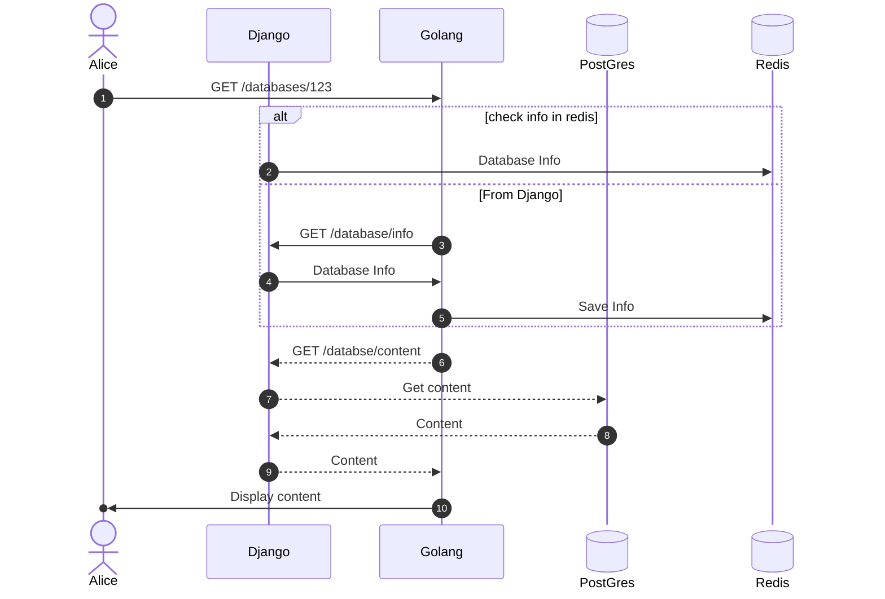

# HTTP Router

```mermaid
sequenceDiagram
    autonumber

    actor U as Alice

    participant D as Django
    participant R as Golang
    participant P@{type: "database"} as PostGres
    participant Re@{type: "database"} as Redis

    U ->> R: GET /databases/123

    alt check info in redis
    D ->> Re: Database Info
    else From Django
    R ->> D: GET /database/info
    D ->> R: Database Info
    R ->> Re: Save Info
    end

    R -->> D: GET /databse/content
    D -->> P: Get content
    P -->> D: Content
    D -->> R: Content
    R ->> ()U: Display content
```
